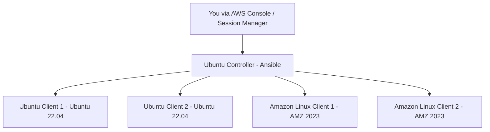

🧠 Homework 1 — Ansible Automation Project
📘 Objective

Set up an Ansible Controller on Ubuntu and connect it to four client nodes (2 Amazon Linux 2023 and 2 Ubuntu).
Then, write a playbook with three plays to automate Apache installation, Git setup, and display a custom debug message across all clients.

🖥️ Project Overview
🧩 Tasks

Setup:

Launch one Ubuntu EC2 instance as the Ansible Controller.

Launch four client EC2 instances (2 Ubuntu + 2 Amazon Linux 2023).

Configure SSH key-based authentication between the controller and all clients.

Verify connections using the ping module.

Playbook Requirements:

PLAY 1: Deploy Apache Webserver on Ubuntu clients with a custom web page message.

PLAY 2: Install Git on all Ubuntu clients.

PLAY 3: Use the DEBUG module to display your name on all hosts using a variable.

Submission:

Push your playbook file to GitHub.

Include screenshots showing successful execution and results.

Export your output as a PDF file for submission.


### 🏗️ Architecture

---


## ✅ Plays
1️⃣ Deploy Apache Webserver on Ubuntu Clients  
2️⃣ Install Git on Ubuntu Clients  
3️⃣ Display My Name on All Hosts using Debug module  

## launch an ubuntu controller and 4 clients(2 amazon client and 2 ubuntu cleint)


## conect to the controller


## Install Ansible on Controller

- Configure the PPA on your system and install Ansible:

```bash
$ sudo apt update
$ sudo apt install software-properties-common
$ sudo add-apt-repository --yes --update ppa:ansible/ansible
$ sudo apt install ansible
```
---


## Generate SSH Key Pair on Controller
```bash
-ssh-keygen -t rsa
```
-Press Enter for all prompts.


- share the public key with the cleints by pasting it into authorised key file on each cleint and test the connectivity from the controller.


## input our clients into an inventory file


## verify if all setup is correct using the ad-hoc cmd ping module
```bash
 ansible all -m ping
```


## write a playbook with three plays
   ( look above for the playbook)

## 🖥️ Verification of the playbook
```bash
 ansible-playbook multi_play.yml
```


### verify apache on the ubuntu clients


  

---

## 📘 Conclusion

This project successfully demonstrated the setup and automation capabilities of **Ansible** across multiple Linux environments.

Starting from launching an **Ubuntu Controller** and four clients (**2× Ubuntu**, **2× Amazon Linux 2023**), SSH keys were used for secure connectivity, and the setup was verified using the **ping ad-hoc module**.

The three-play Ansible playbook achieved the following:
1. Deployed **Apache Webserver** on Ubuntu clients with a custom welcome message.
2. Installed **Git** on Ubuntu clients.
3. Used the **Debug** module to display the user’s name across **all managed hosts**.

Through this exercise, we demonstrated how Ansible simplifies configuration management, package installation, and remote task execution with just a few lines of YAML — proving its efficiency for both small and large-scale automation.

---

## 🧩 Key Takeaways
- ✅ Learned how to configure a centralized **Ansible Controller**.  
- ✅ Practiced secure **SSH connectivity** between controller and clients.  
- ✅ Applied **ad-hoc commands** and **playbooks** for automation.    

---

## 💬 Author
**Ebsiy Anslem**  
📍 Cloud & DevOps Engineer in Training  


